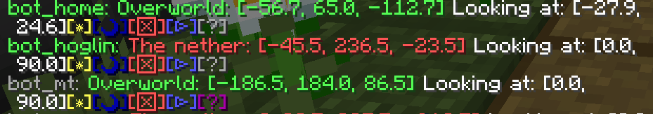

# EasyBotManager

[English](README_en.md)

---

基于[MCDR](https://github.com/Fallen-Breath/MCDReforged)的支持简单操作carpet端假人的插件

## 为什么使用该插件
---
目前MCDR的Bot管理插件，要么没有建议的在指定位置生成Bot的功能，要么没有存储Bot的功能，并且操作也往往不够简单。本插件相对来说有以下优点：
- 可以在任意指定位置生成Bot并记录，而不需要玩家亲自跑到对应位置。在已知坐标或想加载对应位置区块时可以简化操作。
- 可以在记录的位置处直接生成Bot。可以简化加载的操作。
- 良好的操作界面，可以在`!!bot list`的结果处点击直接召唤，踢出，删除，修改Bot，并可追加注释。

## 如何使用该插件
---
### 控制台/游戏内命令

在游戏或MCDR控制台中输入`!!bot help`来查看帮助

本插件约定以下表示方式：
- []内为可选参数，且只有该参数指定后，该参数之后的可选参数才可以被指定（也就是说不能跳过某个可选参数，直接指定后面的可选参数）
- <>内为非字面量参数名，请不要直接按照字面输入，而是输入对应的数据，如坐标等
- here, online, offline等不被<>包裹的是字面量，请按照字面量直接输入
- | 分割多个可能的选项，请选择其中一个输入
- 位置坐标为一组三个数字（浮点数），中间用空格隔开，如 `1 64.5 -2.5` 代表Minecraft中坐标`[X=1, Y=64.5, Z=-2.5]`对应的位置
- 视线坐标为一组两个数字（浮点数），中间用空格隔开。第一个数字为水平旋转角，第二个数字为俯仰角。如 `180 -45` 代表看向正南方顺时针旋转`180°`（即正北方），向上方`45°`仰视。（详见[实体格式 - Minecraft Wiki](https://minecraft.fandom.com/zh/wiki/%E5%AE%9E%E4%BD%93%E6%A0%BC%E5%BC%8F)中对`Rotation`的解释

```
!!bot或!!bot help: 显示帮助

!!bot list [all]: 列出所有Bot
!!bot list [online|offline]: 只列出在线/离线的Bot

!!bot add <bot> [here] [<comment>]: 添加一个名为<bot>的Bot，将其位置与视线设置在玩家处（不可在控制台使用），并为其添加注释<comment>
!!bot add <bot> <pos> <view> <dim> [<comment>]: 添加一个名为<bot>的Bot，将其位置设置为<dim>维度下的<pos>，将其视线设置为看向<view>，并为其添加注释<comment>。该命令在控制台和游戏内均可使用。如果在游戏内使用，<pos> <view> <dim>均可视情况省略，此时该参数将设置为与玩家当前相同。

!!bot remove <bot>: 删除名为<bot>的Bot

!!bot set <bot> here [<comment>]: 将名为<bot>的Bot的位置等参数设置到玩家处（不可在控制台使用），如果<comment>存在则修改注释为<comment>
!!bot set <bot> <pos> <view> <dim> [<comment>]: 将名为<bot>的Bot的位置等参数设置到对应位置，如果<comment>存在则修改注释为<comment>

!!bot spawn [<bot>|all]: 召唤名为<bot>的Bot上线到对应位置，或召唤全部Bot上线
!!bot kill [<bot>|all]: 下线名为<bot>的Bot，或下线全部Bot

!!bot refresh: 刷新所有Bot的在线状态（一般不需要手动刷新）
```

---
### 可视化界面

在游戏内输入`!!bot list`后，可以获得如下的Bot列表：


每个Bot一行，以
`<bot>: <dim>: <pos> Looking at: <view>[☼][☽][☒][▷][?]`
格式表示
```
"<bot>": Bot名称，绿色为在线，灰色为离线
"<dim>: <pos>": Bot的维度与位置，不同的维度对应不同的颜色，点击可以生成传送到该位置的tp命令
"Looking at: <view>": Bot的视线方向
"[☼]": 点击以召唤该Bot
"[☽]": 点击以下线该Bot
"[☒]": 点击以生成删除该Bot的指令，再次按下回车则删除该Bot
"[▷]": 点击以生成将该Bot的位置等参数设置到当前位置的指令，再次按下回车来确认
"[?]": 指向该图标来查看对该Bot的注释，灰色为无注释，紫色为有注释
```
