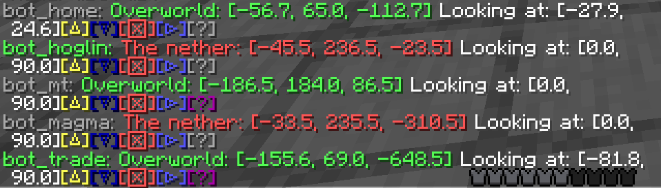

# EasyBotManager

[中文](README.md)

---

A easy-to-use carpet bot manager plugin based on [MCDR](https://github.com/Fallen-Breath/MCDReforged)

## Why this plugin?
---
Currently, other MCDR bot manager, either could not spawn bot at a specified position, or could not store the status of bots. Besides, some of them are hard to use. Compared to them, this plugin has the following advantages:
- Can summon and record a bot at any position, without the need of player being there. This is useful when you want to summon the bot at the position you know or when you want to load the specific chunk(s).
- Can summon the bot at the recorded position. It makes loading, for example, a mob farm, a easy task.
- Visualized control panel. You can summon, kick, remove, modify bots by simply clicking and pressing enter using `!!bot list`. You can also add comments to bots.

## How to use?
---
### MCDR Console/In-game Command

Input `!!bot help` in MCDR Console/Chat box in game to get help.

Representation convention:
- []: Optional parameter. Only if the parameter got specified, parameters behind this parameter could be specified. (Which means you could not skip a optional parameter to specify the parameters behind it.)
- <>: Non-literal parameter name. Do NOT input the parameter literally. Please input the related data (e.g. coordinate)
- Parameters outside <>: Literal parameter. Please input the parameter literally.
- | separates multiple options. Please input ONE of them.
- Position coordinate is a group of 3 (floating) numbers, separated by one blank space. For example, `1 64.5 -2.5` represents the coordinate `[X=1, Y=64.5, Z=-2.5]` in game.
- View coordinate is a group of 2 (floating) numbers, separated by one blank space. For example, `180 -45` means rotate `180°` clockwise from southward, and look `45°` upwards. (For details, see the explanation to `Rotation` in [Player.dat Format - Minecraft Wiki](https://minecraft.fandom.com/wiki/Player.dat_format))

```
!!bot或!!bot help: Show help message

!!bot list [all]: List all Bots
!!bot list [online|offline]: List online/offline Bots only

!!bot add <bot> <pos> <view> <dim> [<comment>]: Add a Bot named <bot>, at <pos>, looking at <view>, in dimension <dim>, and a comment <comment>. <pos> <view> <dim> could either be a value like '1 64.5 -2.5', '180 -45', 'minecraft:overworld', or literally 'here', which means set to the player's position/ view coordinate/ dimension. 'here' is the default value when not specified. NOTE: 'here' could not be used in MCDR console.

!!bot remove <bot>: Delete a Bot named <bot>
!!bot remove <bot> comment: Delete the comment of Bot <bot> (will not delete the Bot itself)

!!bot set <bot> <pos> <view> <dim> [<comment>]: Set the Bot <bot> to the specified position, view and dimension. If <comment> is not empty, change the comment of this Bot to <comment>. In addition to value or 'here', described in '!!bot add', <pos> <view> <dim> could also be literally 'keep', which means do not change the value. 'keep' could be used in MCDR console (while 'here' could not).
!!bot set <bot> comment <comment>: Set the comment of the Bot <bot>. This is a shorter version of '!!bot set <bot> keep keep keep <comment>'.

!!bot spawn [<bot>|all]: Spawn the Bot <bot> to its stored location, or summon all the Bots.
!!bot kill [<bot>|all]: Kick the Bot <bot>, or kick all the Bots.

!!bot refresh: Refresh online status of all Bots. (Usually manual refreshment is not needed.)
```

---
### Visualized Control Panel

Input `!!bot list` in game, and you will get a bot list like the following example：


One Bot per line, formatted in
`<bot>: <dim>: <pos> Looking at: <view>[△][▽][☒][▷][?]`

```
"<bot>": Bot's name, green means online, gray means offline.
"<dim>: <pos>": The dimension and position of the Bot. Different dimensions have different colors. Click to generate the command that teleports the player to this position.
"Looking at: <view>": The view direction of the Bot
"[△]": Click to summon this Bot
"[▽]": Click to kick this Bot
"[☒]": Click to generate the command that removes this Bot, press enter to confirm
"[▷]": Click to generate the command that sets the parameters like position of this Bot to the player's location, press enter to confirm
"[?]": Hover to view the comment to this Bot. Gray means no comment, purple means there is a comment.
```
